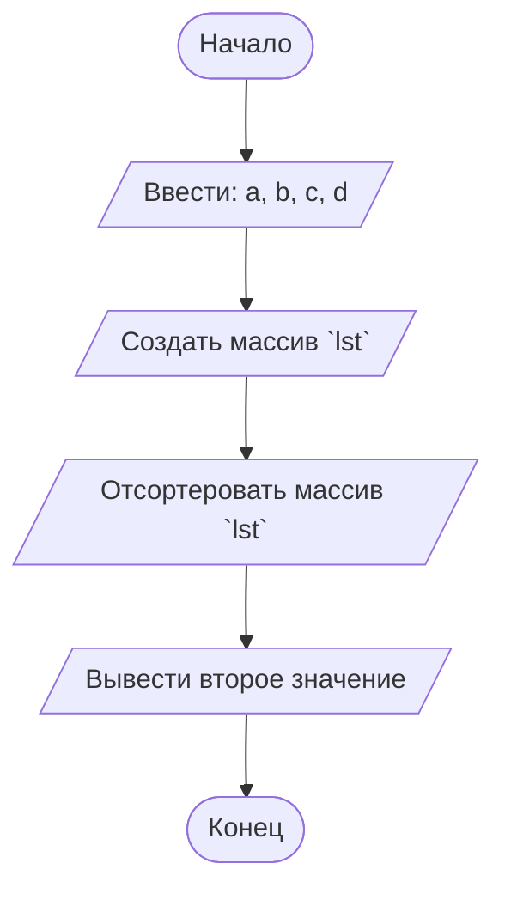

## Отчет по лабораторной работе № 1

#### № группы: `ПМ-2502`

#### Выполнил: `Филиппов Данил Константинович`

#### Вариант: `22`

### Cодержание:

- [Постановка задачи](#1-постановка-задачи)
- [Входные и выходные данные](#2-входные-и-выходные-данные)
- [Выбор структуры данных](#3-выбор-структуры-данных)
- [Алгоритм](#4-алгоритм)
- [Программа](#5-программа)
- [Анализ правильности решения](#6-анализ-правильности-решения)

### 1. Постановка задачи

> Программа на вход получает четыре различных числа. Нужно вывести на
> экран число, которое больше одного и меньше двух других чисел.

Данную задачу можно разделить на 2 подзадачи: сортировки всех чисел по возрастанию и получение второго числа поледовательности.

### 2. Входные и выходные данные

#### Данные на вход

На вход программа должна получать 4 числа, при этом в условии сказано, что они целые,
но не сказаны ограничения этих чисел, поэтому будем считать, что они принадлежат типу данный `long`.

|             | Тип                | min значение    | max значение   |
|-------------|--------------------|-----------------|----------------|
| A (Число 1) |     целое число    | -109 | 109 |
| B (Число 2) |     целое число    | -109 | 109 |
| C (Число 3) |     целое число    | -109 | 109 |
| D (Число 4) |     целое число    | -109 | 109 |

#### Данные на выход

Так как программа должна вывести второе по счету в отсортерованном списке по возрастанию,
то на выходе мы получим число лежащее в диапозоне от: -109 до: 109

|             | Тип                | min значение    | max значение   |
|-------------|--------------------|-----------------|----------------|
|      X      |     целое число    | -109 | 109 |

### 3. Выбор структуры данных

Программа получает 4 целый числа, с неуказанными ограничениями, поэтому для их
хранения можно выделить 4 переменных (`a`, `b`, `c`, `d`) типа `long`.

### 4. Алгоритм

#### Алгоритм выполнения программы:

1. **Ввод данных:**
  Программа считывает четыре целых числа, обозначенные как: `a`, `b`, `c`, `d`.

2. **Создание массива:**  
  Программа создает массив `lst` состаящий из четырех значений: `a`, `b`, `c`, `d`.

3. **сортировка массива:**
   Используем функцию `sort`, для того, чтобы отсортеровать массив `lst`.

4. **Вывод результата:**
   На экран выводится второй элемент отсортерованного по возрастанию массива.

#### Блок-схема

   
