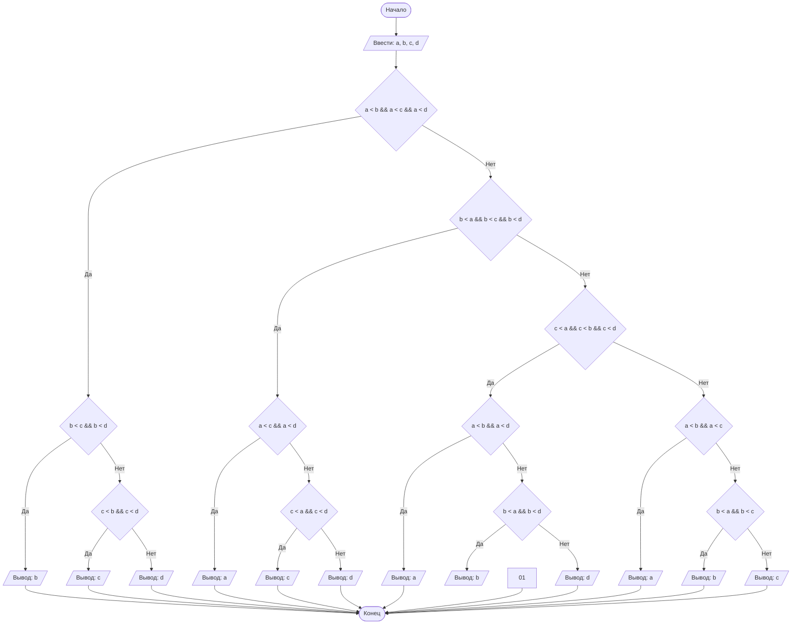

## Отчет по лабораторной работе № 1

#### № группы: `ПМ-2502`

#### Выполнил: `Филиппов Данил Константинович`

#### Вариант: `22`

### Cодержание:

- [Постановка задачи](#1-постановка-задачи)
- [Входные и выходные данные](#2-входные-и-выходные-данные)
- [Выбор структуры данных](#3-выбор-структуры-данных)
- [Алгоритм](#4-алгоритм)
- [Программа](#5-программа)
- [Анализ правильности решения](#6-анализ-правильности-решения)

### 1. Постановка задачи

> Программа на вход получает четыре различных числа. Нужно вывести на
> экран число, которое больше одного и меньше двух других чисел.

Данную задачу можно разделить на 2 подзадачи: сортировки всех чисел по возрастанию и получение второго числа поледовательности.

### 2. Входные и выходные данные

#### Данные на вход

На вход программа должна получать 4 числа, при этом в условии сказано, что они целые,
но не сказаны ограничения этих чисел, поэтому будем считать, что они принадлежат типу данный `long`.

|             | Тип                | min значение    |   max значение    |
|-------------|--------------------|-----------------|-------------------|
| A (Число 1) |     целое число    | -2<sup>63</sup> | 2<sup>63</sup> -1 |
| B (Число 2) |     целое число    | -2<sup>63</sup> | 2<sup>63</sup> -1 |
| C (Число 3) |     целое число    | -2<sup>63</sup> | 2<sup>63</sup> -1 |
| D (Число 4) |     целое число    | -2<sup>63</sup> | 2<sup>63</sup> -1 |

#### Данные на выход

Так как программа должна вывести второе по счету в отсортерованном списке по возрастанию,
то на выходе мы получим число лежащее в диапозоне от: -2<sup>63</sup> до: 2<sup>63</sup> -1

|             | Тип                | min значение    |   max значение    |
|-------------|--------------------|-----------------|-------------------|
|      X      |     целое число    | -2<sup>63</sup> | 2<sup>63</sup> -1 |

### 3. Выбор структуры данных

Программа получает 4 целый числа, с неуказанными ограничениями, поэтому для их
хранения можно выделить 4 переменных (`a`, `b`, `c`, `d`) типа `long`.

### 4. Алгоритм

#### Алгоритм выполнения программы:

1. **Ввод данных:**
  Программа считывает четыре целых числа, обозначенные как: `a`, `b`, `c`, `d`.

2. **Создание массива:**  
  Программа создает массив `lst` состаящий из четырех значений: `a`, `b`, `c`, `d`.

3. **сортировка массива:**
   Используем функцию `sort`, для того, чтобы отсортеровать массив `lst`.

4. **Вывод результата:**
   На экран выводится второй элемент отсортерованного по возрастанию массива.

#### Блок-схема



### 5. Программа

```java
import java.io.PrintStream;
import java.util.Scanner;


public class j_1{
    // Объявляем объект класса Scanner для ввода данных
    public static Scanner in = new Scanner(System.in);
    // Объявляем объект класса PrintStream для вывода данных
    public static PrintStream out = System.out;
    public static void main (String [] args) {
        // Считывание четырех целых чисел a, b, c, d из консоли
        Scanner scanner = new Scanner(System.in);
        long a = scanner.nextLong(), b = scanner.nextLong();
        long c = scanner.nextLong(), d  = scanner.nextLong();

        if (a < b && a < c && a < d){
            // a - наименьшее
            if (b < c && b < d) out.println(b);
            else if (c < b && c < d) out.println(c);
            else out.println(d);
        }
        else if (b < a && b < c && b < d) {
            // b - наименьшее
            if (a < c && a < d) out.println(a);
            else if (c < a && c < d) out.println(c);
            else out.println(d);
        }
        else if (c < a && c < b && c < d) {
            // c - наименьшее
            if (a < b && a < d) out.println(a);
            else if (b < a && b < d) out.println(b);
            else out.println(d);
        }
        else {
            // d - наименьшее
            if (a < b && a < c) out.println(a);
            else if (b < a && b < c) out.println(b);
            else out.println(c);
        }
    }
}
```

### 6. Анализ правильности решения

Программа работает корректно на всем множестве решений с учетом ограничений.

1. Тест на `D > C > B > A > 0`:

    - **Input**:
        ```
        4 3 2 1
        ```

    - **Output**:
        ```
        2
        ```
        
2. Тест на `A < B < C < D < 0`:

    - **Input**:
        ```
        -5 -4 -3 -1
        ```

    - **Output**:
        ```
        -4
        ```

3. Тест на `A > B > 0; C < D < 0`:

    - **Input**:
        ```
        10 8 -7 -2
        ```

    - **Output**:
        ```
        -2
        ```
  
4. Тест на ограничение задачи:

    - **Input**:
        ```
        34359738368 34359738369 34359738370 34359738371
        ```

    - **Output**:
        ```
        34359738369
        ```
